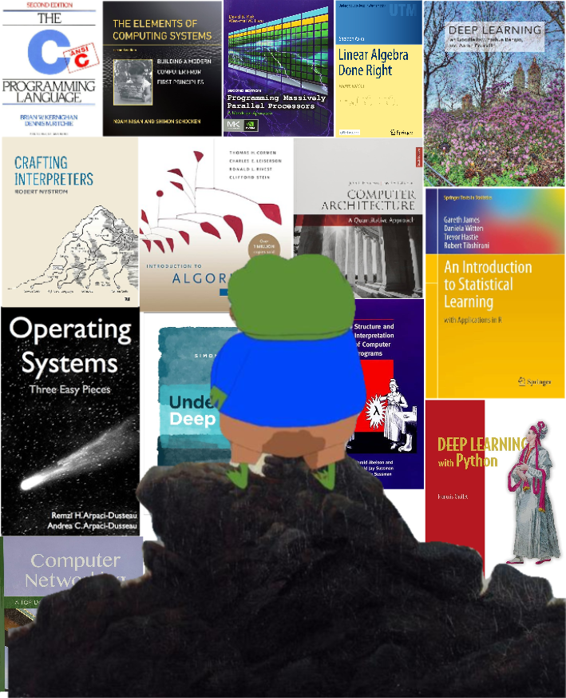

---
links:
  - title: LinkedIn
    description: Check out my linkedIn page!
    website: https://www.linkedin.com/in/shivang-jhalani/
    image: https://upload.wikimedia.org/wikipedia/commons/thumb/c/ca/LinkedIn_logo_initials.png/200px-LinkedIn_logo_initials.png
  - title: GitHub
    description: Check out my github profile!
    website: https://github.com/shivangjhalani
    image: https://upload.wikimedia.org/wikipedia/commons/archive/9/91/20180806170714%21Octicons-mark-github.svg
menu:
    main:
        name: Home
        weight: 1
        params:
            icon: home
layout: home
---

# __Hello, I am Shivang__

I'm doing bachelors in CS. I am exploring and low level coding and computer architecture are my current interests.

I am proficient in C and Linux (I daily drive NixOS btw), I've dabbled in web dev, and am excited to learn AI soon.

Right now, I'm getting my hands dirty with Golang and nerding out over the book 'Computer Systems: A Programmer's Perspective' to strengthen my understanding of what my code does under the hood.

```
Studying CS
Linux enthusiast (NixOS btw)
Low level
Learning AI
Web Dev
Reinventing the wheel
```


<p align="center">
  
</p>
