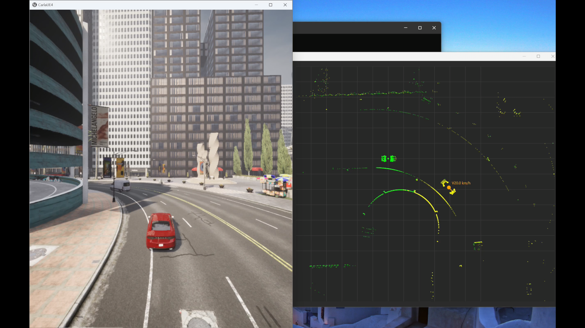

## Context
This is a project built for a national level **hackathon** : Code Red 25 organised by BMSIT College, Bangalore

**Problem Statement**  
Develop a real-time IoT system enabling vehicles to exchange critical data such as location, speed, and road conditions to enhance road safety. The system should alert vehicles to sudden stops, road hazards, or traffic changes, reducing accidents and supporting autonomous or semi-autonomous driving.

## The idea
In real time, collect data through an array of sensors, especially LiDAR (Light Detection and Ranging)  
Build an IoT network (which I didn't have much idea about, but luckily my teammates did and I learned a lot through it)  
The part I worked on was: Run the simulation to collect the sensor data in real time and use it to build a real time dashboard application which would be nicely presented to the driver to help him stay more informed and vigilant on the roads.

## Demo

  


